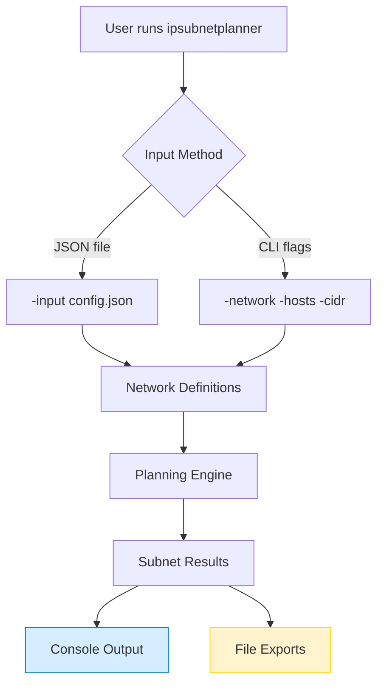
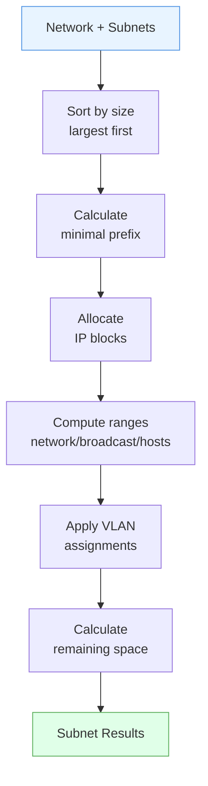
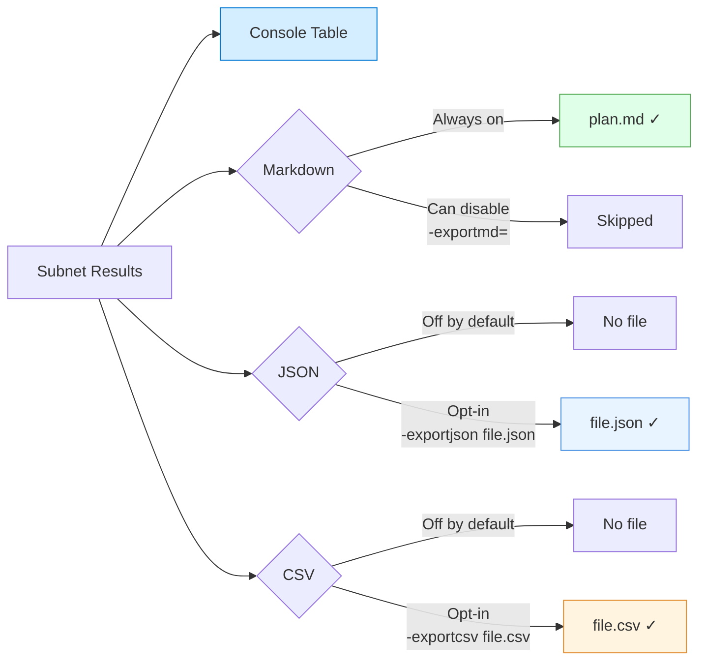

# IPSubnetPlanner

[](https://github.com/microsoft/IPSubnetPlanner/actions/workflows/build_artifacts.yml)
[](https://github.com/microsoft/IPSubnetPlanner/actions/workflows/unit_test.yml)
[](LICENSE)

Fast, zero‑friction IP subnet planning from a simple JSON file. No spreadsheets. No manual math.

> Internal utility we found useful and open sourced. Not a supported Microsoft product.

## Features (What You Get)
* Plan subnets by host count OR fixed CIDR
* Optimal packing (largest first) + remaining space summary
* Optional VLAN IDs & named IP assignments
* Multi‑network (array) input
* Markdown export by default (plan.md)
* Opt-in JSON / CSV (only if you supply filenames)

## Quick Start (Download & Run)
1. Go to Releases: https://github.com/microsoft/IPSubnetPlanner/releases
2. Download the latest binary for your OS (Windows / Linux / macOS)
3. (Linux/macOS) Make it executable: `chmod +x ipsubnetplanner*`
4. Run with the provided example (prints table + writes plan.md):
  ```bash
  ./ipsubnetplanner -input examples/simple.json
  ```
5. (Optional) Opt-in exports (you must give filenames for JSON / CSV):
  ```bash
  ./ipsubnetplanner -input examples/simple.json -exportjson plan.json -exportcsv plan.csv -exportmd report.md
  ```

Need to customize? Create your own JSON (see use cases below).

## Architecture Overview

### High-Level Flow



### Planning Engine Details



### Export Behavior



**Key Points:**
* **Input flexibility**: JSON file or inline CLI flags (`-network`, `-hosts`, `-cidr`)
* **Smart allocation**: Largest subnets first to minimize fragmentation
* **Default export**: Markdown always created unless explicitly disabled
* **Opt-in exports**: JSON/CSV only generated when you specify filenames


---
## Top 3 Use Cases

### 1. Single Network (Mixed Hosts + CIDR)
`single.json`
```json
{
  "network": "192.168.1.0/24",
  "subnets": [
    { "name": "Users", "hosts": 100, "vlan": 102 },
    { "name": "Management", "hosts": 30, "vlan": 101 },
    { "name": "Servers", "cidr": 27, "vlan": 103 }
  ]
}
```
Run (table + plan.md):
```bash
./ipsubnetplanner -input single.json
```
Sample Output:
```
Name         VLAN  Subnet             Prefix  FirstHost       LastHost        UsableHosts
Users        102   192.168.1.0/25     25      192.168.1.1     192.168.1.126   126
Management   101   192.168.1.128/27   27      192.168.1.129   192.168.1.158   30
Servers      103   192.168.1.160/27   27      192.168.1.161   192.168.1.190   30
Available          192.168.1.192/26   26      192.168.1.193   192.168.1.254   62
```

### 2. VLAN + Named IP Assignments
`advanced.json`
```json
{
  "network": "10.0.0.0/24",
  "subnets": [
    {
      "name": "Management",
      "cidr": 28,
      "vlan": 100,
      "IPAssignments": [
        { "Name": "Gateway", "Position": 1 },
        { "Name": "DNS1", "Position": 2 },
        { "Name": "DNS2", "Position": 3 },
        { "Name": "LastHost", "Position": -1 }
      ]
    },
    { "name": "Storage", "hosts": 50, "vlan": 110 },
    { "name": "Compute", "cidr": 26, "vlan": 120 }
  ]
}
```
Opt-in exports:
```bash
./ipsubnetplanner -input advanced.json -exportjson plan.json -exportcsv plan.csv -exportmd plan.md
```
Excerpt (Markdown):
```
| Name       | VLAN | Subnet      | Gateway    | DNS1       | DNS2       | LastHost   |
|------------|------|-------------|------------|------------|------------|------------|
| Management | 100  | 10.0.0.0/28 | 10.0.0.1   | 10.0.0.2   | 10.0.0.3   | 10.0.0.14  |
```

### 3. Multi‑Network Planning
`multi-network.json`
```json
[
  {
    "network": "10.1.0.0/24",
    "subnets": [
      { "name": "Production-Web", "vlan": 100, "cidr": 26 },
      { "name": "Production-App", "vlan": 101, "cidr": 26 },
      { "name": "Production-DB", "vlan": 102, "cidr": 27 }
    ]
  },
  {
    "network": "10.2.0.0/24",
    "subnets": [
      { "name": "Management-Network", "vlan": 200, "cidr": 26 },
      { "name": "Storage-Network", "vlan": 201, "hosts": 50 }
    ]
  },
  {
    "network": "10.3.0.0/24",
    "subnets": [
      { "name": "Dev-Environment", "vlan": 300, "hosts": 100 },
      { "name": "Test-Environment", "vlan": 301, "hosts": 50 }
    ]
  }
]
```
Run:
```bash
./ipsubnetplanner -input multi-network.json
```

---
## Minimal Config Reference
Subnet (choose hosts OR cidr):
```json
{
  "name": "Web", "hosts": 120, "vlan": 10
}
```
Field | Meaning
------|--------
hosts | Required host count (tool picks smallest fitting prefix)
cidr | Fixed prefix length (1–32)
vlan | Optional VLAN ID (0–4094)
IPAssignments | Array of { Name, Position }

IP Positions:
* 1 = first usable host, 2 = second, etc.
* -1 = last address, -2 = second last
* 0 allowed only when vlan = 0 (special /31 or /32 contexts)

Rules:
* Exactly one of hosts or cidr
* Largest required subnets allocated first
* Remaining space reported as "Available"

## Commands

**Recommended (new intuitive flag names):**
```bash
ipsubnetplanner -input config.json                          # table + plan.md
ipsubnetplanner -input config.json -exportmd design.md      # override markdown filename
ipsubnetplanner -input config.json -exportmd=""             # disable markdown export
ipsubnetplanner -input config.json -exportjson out.json     # enable JSON export
ipsubnetplanner -input config.json -exportcsv out.csv       # enable CSV export
ipsubnetplanner -input config.json -exportjson out.json -exportcsv out.csv -exportmd report.md
ipsubnetplanner -version
```

**Legacy (still supported for backward compatibility):**
```bash
ipsubnetplanner -f config.json                              # table + plan.md
ipsubnetplanner -f config.json -md design.md                # override markdown filename
ipsubnetplanner -f config.json -md=""                       # disable markdown export
ipsubnetplanner -f config.json -json out.json               # enable JSON export
ipsubnetplanner -f config.json -csv out.csv                 # enable CSV export
ipsubnetplanner -f config.json -json out.json -csv out.csv -md report.md
```

## Build From Source
```bash
cd IPSubnetPlanner/src
go build -o ../ipsubnetplanner
```
Cross‑compile:
```bash
GOOS=linux GOARCH=amd64   go build -o dist/ipsubnetplanner-linux-amd64 ./src
GOOS=windows GOARCH=amd64 go build -o dist/ipsubnetplanner-windows-amd64.exe ./src
```

## Optional: Run Tests
```bash
cd src
go test -v
go test -cover
```